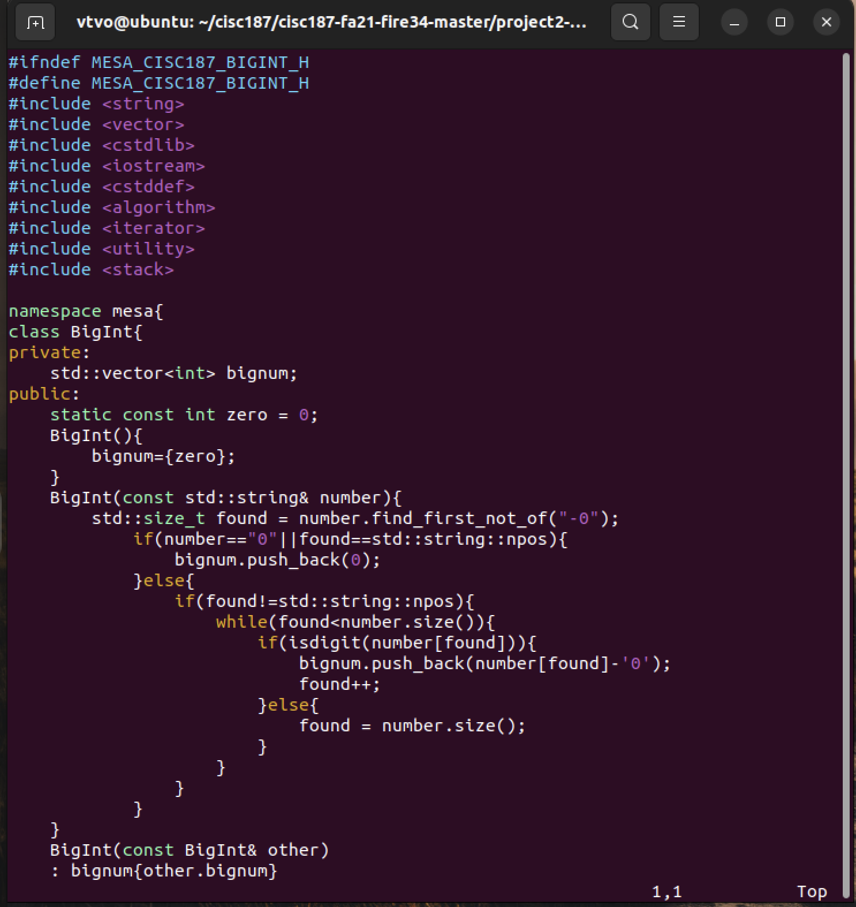
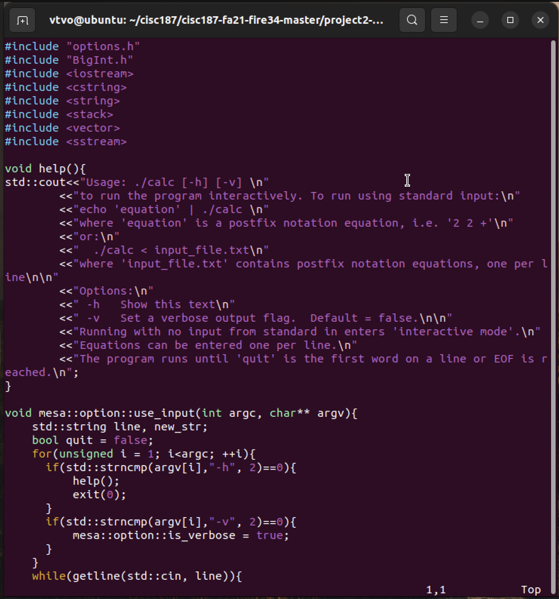
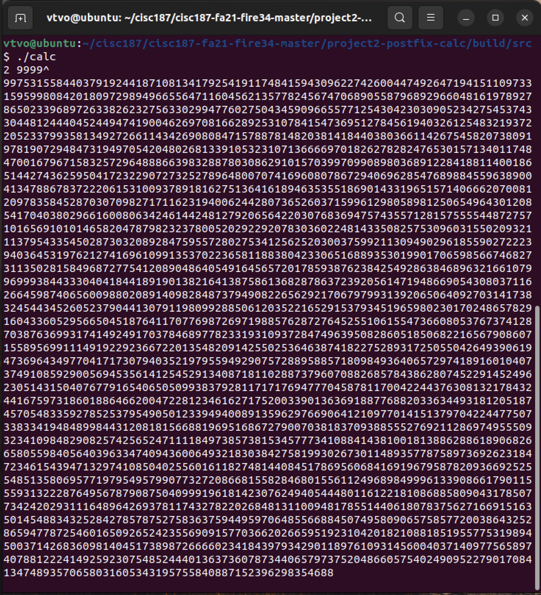
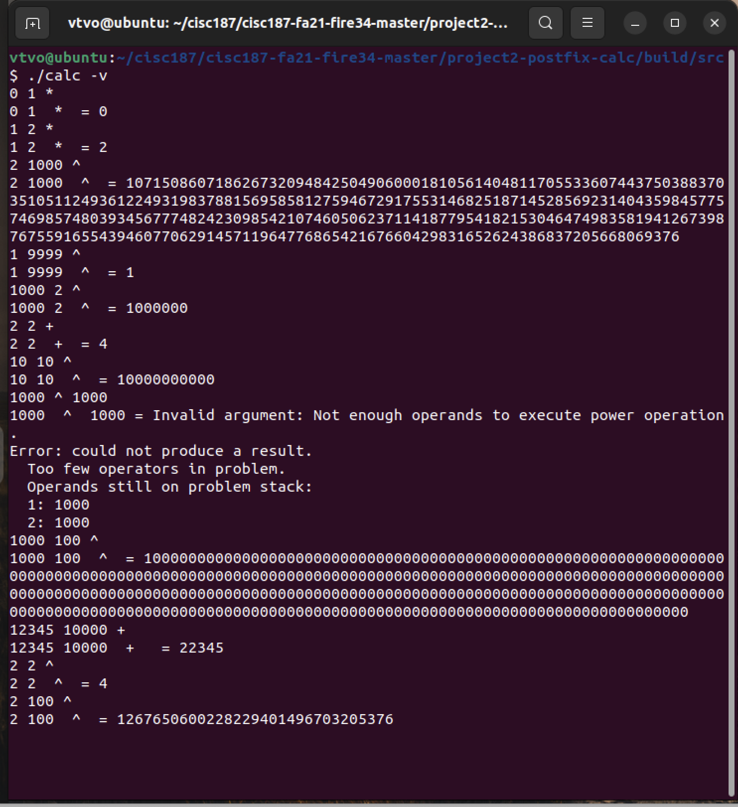

### Description 

This project implements a postfix calculator which can perform basic arithmetic calculation such as `+ * ^` with unlimited integers. The project will be run interactively with input from the shell. 

### Code

